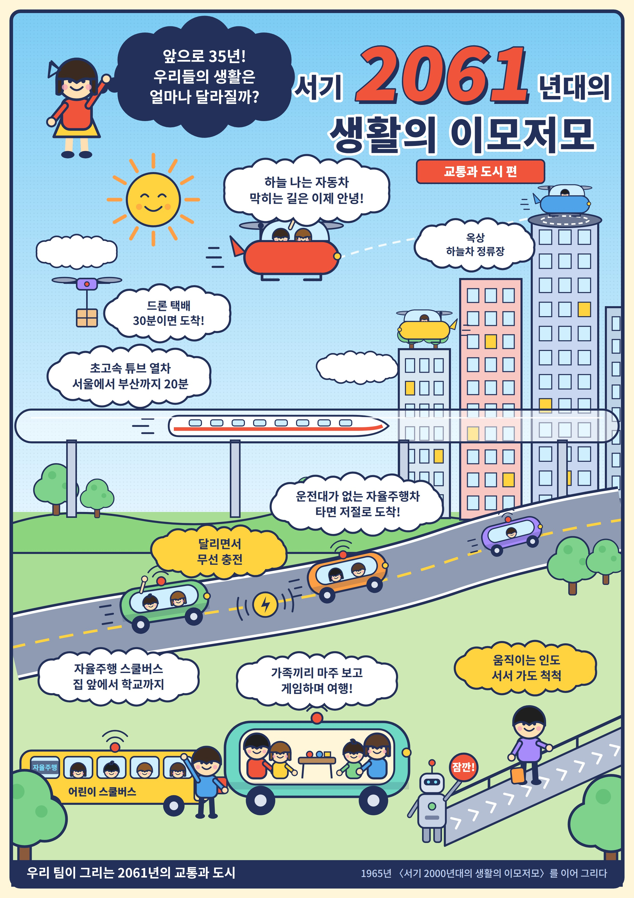

# Welcome to E26-AI01-12

## 🎯 팀 슬로건

> 실패는 데이터다. 우리는 학습한다!

## 🖼️ 팀 포스터

<div class="poster"></div>

<p align="center" class="poster-caption"><sub>E26-AI01-12 팀, 「서기 2061년대의 생활의 이모저모 – 교통과 도시 편」(2026). 이정문 화백의 「서기 2000년대 생활의 이모저모」(1965)를 이어 그렸습니다.</sub></p>

1965년에 35년 뒤의 생활을 상상해 그린 그림처럼, 우리 팀은 지금부터 35년 뒤인 2061년의 교통과 도시를 상상해 보았습니다.
하늘 나는 자동차, 초고속 튜브 열차, 운전대 없는 자율주행차, 드론 택배처럼 인공지능이 바꿔 놓을 이동의 모습을 담았습니다.

***

## 1️⃣ 팀원 소개

| **이름** | **전공** | **관심사** |
| --- | --- | --- |
| **이동민** | 인공지능전공 | 창업, 인공지능, ui/ux |
| **김태성** | 인공지능전공 | 인공지능, 게임, 알고리즘 |
| **차성민** | 인공지능전공 | 자율주행, 신경망, 보안 |
| **이가은** | 인공지능전공 | 인공지능, 창업, 로봇 |


### 팀 소개

서로의 다름을 이해하고, 함께 배우며 성장해 나가는 팀

***

## 2️⃣ 공통된 관심사 : 여행, 백엔드, 인공지능

*** 인공지능 창업

## 3️⃣ 한학기 동안의 활동 내역 

- 기관/부서 인터뷰 ✔️  

- 현장 탐방 ✔️  

- 멘토링 ✔️  
  - 내 지도 교수 함게 만나기
  - 대학원 방문 및 선배 만나기

- 프로젝트 진행 ✔️  
  - 과거에 사람들이 상상한 미래
  - 그들이 만들어가는 세상
  - 우리가 상상한 미래
  - 우리가 그리는 미래 그리고 나

- 각오와 소감 나누기 ✔️  


<!-- 활동 사진 추가 예시 -->


***

## 3주차 활동 의견 및 소감
   이동민: 

이정문 화백의 1965년 상상은 단순히 미래 기술의 모양을 예측한 것이 아니라, 사람들이 원하는 편리한 생활을 먼저 생각했다는 점에서 의미가 있다. 실제 모습은 조금 달라졌지만 화상통화, 전기자동차, 원격수업처럼 핵심 기능은 오늘날 대부분 현실이 되었다. 미래를 예측할 때는 기술 자체보다 사람들이 어떤 불편을 해결하고 싶어 하는지 살펴보는 것이 중요하다고 생각한다.

당시에는 허무맹랑하게 보였던 상상이 약 60년 뒤 일상이 되었다는 점이 가장 인상적이었다. 특히 한 사람의 상상이 기술 발전의 방향을 미리 보여줄 수 있다는 사실이 흥미로웠다. 이번 활동을 통해 현재 불가능해 보이는 아이디어도 사회적 필요와 기술이 만나면 현실이 될 수 있다는 것을 배웠다.

차성민: 
과거에 만들어진 포스터의 내용이 현재 대부분 구현되어있다는 점이 놀라움. 하지만 우주 산업 및 의료 산업에 대한 내용은 아직 기술적으로 어렵다는 생각이 들었고, 자율주행 시스템이 상용화가 되기 위해선 기술적이 아닌, 윤리적 및 정책적인 보완이나 논의가 필요하다는 생각이 듦. 또한 최근 AI 관련해서도 안전한 미래를 위한 규제가 느슨하다는 관점이 다시금 주목받는 시점인 만큼, 미래에 대한 혁신적인 기술이 발전하기 전에는 여러 윤리적인 규제가 필요하다고 생각하게 됨.

김태성: 2000년대 자료를 통해 과거에 상상했던 기술들이 현재 구현된 모습을 보며, 향후 35년 뒤의 미래는 어떠한 수준으로 발전해 있을지 기대가 큽니다. 또한 미래 예측 관련 콘텐츠를 접하며 단순히 상상하는 데 그치지 않고, 미래에 대한 능동적인 질문과 도전을 통해 시대의 변화를 선도하는 인재가 되어야겠다고 다짐했습니다.

## 4️⃣ 인상 깊은 활동

- 활동명 – 활동에 대한 간단한 설명과 배운 점을 작성  
- 예: 멘토링에서 실리콘밸리 현업 경험을 들을 수 있어 진로 방향 설정에 큰 도움이 되었다.  

***

## 5️⃣ 특별히 알아보고 싶은 것
- 예: 현장실습 제도
- 예: 학부 졸업 인증 조건
- 예: 성취기반평가
- 예: 졸업 후 진로(대학원/취업)

***

## 6️⃣ 활동을 마친 소감

🔗학번 이름  
> "소감 내용을 여기에 작성합니다."

🔗학번 이름  
> "소감 내용을 여기에 작성합니다."

🔗학번 이름  
> "소감 내용을 여기에 작성합니다."

🔗학번 이름  
> "소감 내용을 여기에 작성합니다."

🔗학번 이름  
> "소감 내용을 여기에 작성합니다."


## Markdown을 사용하여 내용꾸미기를 익히세요.

Markdown은 작문을 스타일링하기위한 가볍고 사용하기 쉬운 구문입니다. 여기에는 다음을위한 규칙이 포함됩니다.

```markdown
Syntax highlighted code block

# Header 1
## Header 2
### Header 3

- Bulleted
- List

1. Numbered
2. List

**Bold** and _Italic_ and `Code` text

[Link](url) and 
```

자세한 내용은 [GitHub Flavored Markdown](https://guides.github.com/features/mastering-markdown/).

### Support or Contact

readme 파일 생성에 추가적인 도움이 필요하면 [도움말](https://help.github.com/articles/about-readmes/) 이나 [contact support](https://github.com/contact) 을 이용하세요.

